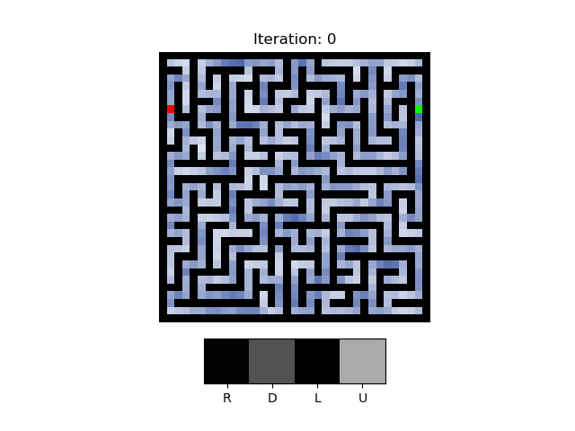

# NeuralSolver 




This repository contains the code used to train and evaluate the NeuralSolver model, as well as the other baselines used in the article "NeuralSolver: Learning Algorithms For Consistent
and Efficient Extrapolation Across General Tasks" by Bernardo Esteves, Miguel Vasco, and Francisco S. Melo.


It is composed of two main parts: the easy-to-hard-data package and the deep-thinking package. The easy-to-hard-data package is used to create the datasets used in the experiments. The deep-thinking package is used to train the models and evaluate them.


# Installing dependencies

Code tested on python 3.11.5

From the root folder:
```bash
#install pytorch following the instructions on https://pytorch.org

cd deep-thinking/

pip install -r requirements.txt
```

Install the easy-to-hard-data package to make the datasets

```bash
cd easy-to-hard-data/
pip install -e .
```

# Creating the datasets
Before being able to train the models, we need to create the datasets.
Use the following commands to do so.

from root folder:
```bash
# different-size tasks
python ./easy-to-hard-data/make_1s_maze.py
python ./easy-to-hard-data/make_pong.py
python ./easy-to-hard-data/make_goto.py
python ./easy-to-hard-data/make_doorkey_dataset.py

# same-size tasks
## prefix sum dataset is downloaded automatically
python ./easy-to-hard-data/make_mazes.py
python ./easy-to-hard-data/make_thin_mazes.py
python ./easy-to-hard-data/make_chess.py
```

# NeuralSolver model
In the file ``deep-thinking/deepthinking/models/neuralsolver.py`` is possible to see the network class used for NeuralSolver, NeuralSolverClass. The methods ``neuralsolver_1d`` and ``neuralsolver_2d`` create the models according to the papers hyperparameters for same-size tasks. And ``neuralsolver_1l_sgal04_py03_2d_out3_maxpool`` and ``neuralsolver_1l_sgal04_py03_2d_out4_maxpool`` makes the models for the different-size tasks.

For adapting to new works, you can directly use the model from the ``neuralsolver_2d`` or ``neuralsolver_1l_2d_out4_maxpool`` in your tasks. 

```python
# Example of model usage
X = torch.randn(32,3,6,6)
Y = torch.randint(0,4,(32,))
net = neuralsolver_1l_sgal04_py03_2d_out4_maxpool(width=64,in_channels=3)

logits, hidden_state = net(X,iters_to_do = 10)

loss = F.cross_entropy(logits,Y)
loss.backward()

```

# Replicating Paper Experiments
[Replicating Paper Experiments](paper_experiments.md)


## Wandb logging
For simplicity we disabled wandb logging in the code. 

To enable it, uncomment the wandb.init() line in the train_model.py file.
And put your wandb details (wandb_entity and wandb_project) on deep-thinking/config/train_model_config.yaml, and on deep-thinking/eval_utils.py.


This repository uses code from https://github.com/aks2203/deep-thinking and https://github.com/aks2203/easy-to-hard-data
