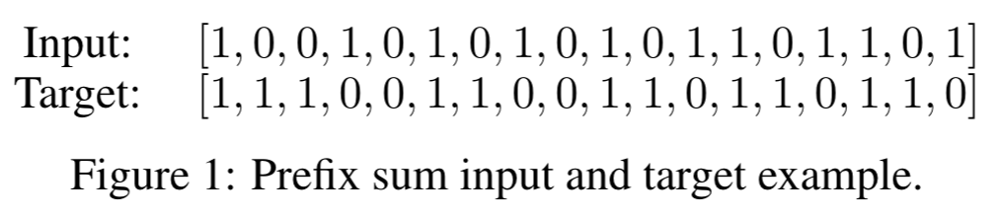
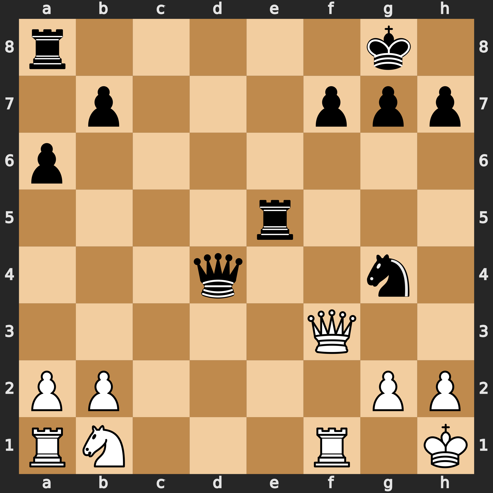
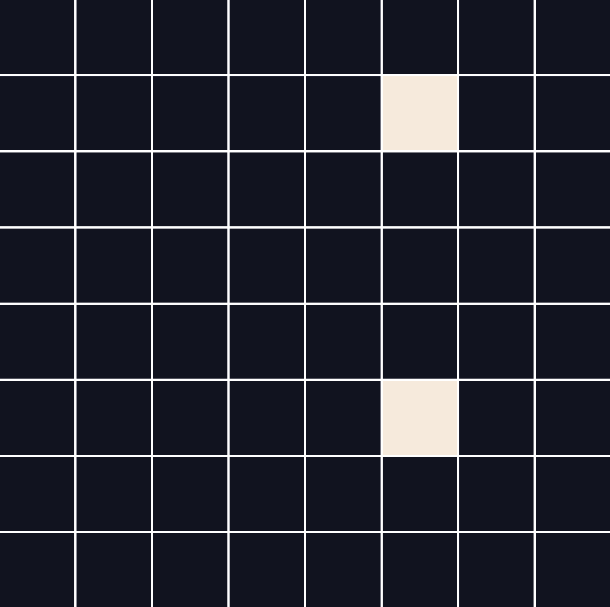
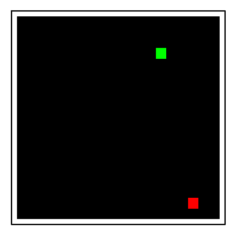
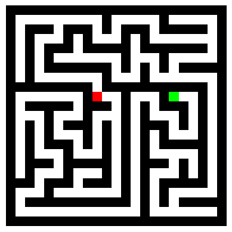
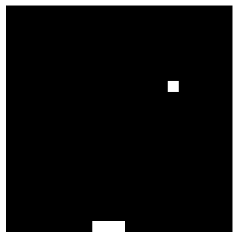
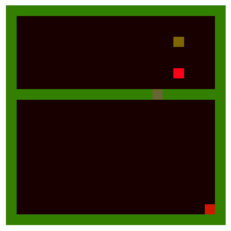
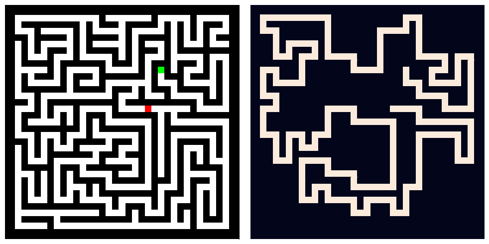

# Easy-To-Hard Datasets
This repository houses Pytorch datasets used to train and evaluate the NeuralSolver model, as well as the other baselines used in the article "NeuralSolver: Algorithm Synthesis that Extrapolates in General Tasks" by Bernardo Esteves, Miguel Vasco, and Francisco S. Melo.

This repository is based on the open-source code from https://github.com/aks2203/easy-to-hard-data.

## Overview

This package contains datasets desinged for use in studying easy to hard generalization. That is, the training data consists of easy examples, and the testing data has harder ones. The datsets are as follows.

### Symetric Problems

1. Prefix Sums
<p align='center'>
  
</p>

- Compute the prefix sum modulo two of a binary input string. 
- The length of the string determines the difficulty of the problem.
- We provide 52 different sets (10,000 samples per length) from which to choose one for training data and a longer one for testing.

2. Mazes
<p align='center'>
  
</p>

- Visually solve a maze where the input is a three channel image, and the output is a binary segmentation mask, which is the same size as the input, separating pixels, with ones at locations that are on the optimal path and zeros elsewhere.
- We provide many size mazes (see below for details).

3. Chess Puzzles
<p align='center'>
  
  
</p>

- Choose the best next move given a mid-game chess board.
- The difficulty is determined by the [Lichess](https://lichess.org/training) puzzle rating.
- We sorted the chess puzzles provided by Lichess, and the first 600,000 easiest puzzles make up an easy training set. Testing can be done with any subset of puzzles with higher indices. The default test set uses indices 600,000 to 700,000.

Note that in this repository there are scripts to make data for prefix sums and for mazes and a script to convert Lichess csv data into torch tensors. Also, we include plotting code for mazes and for chess puzzles.

### Assymentric Problems

1. GoTo
<p align='center'>
  
</p>

- Inspired by the Minigrid Environment (Chevalier-Boisvert et al., 2023), the GoTo task is a simple grid setting, with a 1-pixel white border, and 1-pixel green player, and a 1-pixel red goal. 
- The player has 4 actions (up, down, left, right) available. 
- To generate the dataset we use a simple path-finding algorithm from the player to the goal, where the agent starts by minimizing the vertical distance to the goal until it reaches the same vertical position, and then minimizes the horizontal distance until it reaches the goal.

2. 1S-Maze
<p align='center'>
  
</p>


- This task is based on previous maze task. The input is a maze with the player and goal positions, and the objective is to move the player (in green) to the goal (in red) position by solving the maze.
- We changed the thickness of the walls and the border to 1 pixel. 
- The outputs are 4 actions (up, down, left, right). 
- The dataset is generated using a depth-first search algorithm, where the label is the next action to take to reach the goal. 

3. Pong
<p align='center'>
  
</p>


- Using the Atari Pong game as inspiration, the pong task is a simplified version of the game, where the objective is to move the paddle to the ball position.
- To solve this task, the player has 3 actions (left, right, stay) available.
- The dataset is generated by a simple agent that follows the ball, keeping the paddle centered on the ball.

4. DoorKey
<p align='center'>
  
</p>


- This task uses the Minigrid Doorkey environment from (Chevalier-Boisvert et al., 2023), where the objective is to move the player (red pixel on top) to the goal (red pixel on bottom right), by first moving to the key (yellowish pixel), grabbing it, and then moving to the door (different color pixel on middle separator) and opening it and finally moving to the goal.
- For the dataset, we simplify the original action space to 4 actions (forward, rotate right, grab, toggle), and generate labels using a simple oracle agent that solves the task.


# Installation
This package can also be installed from source, by cloning the repository as follows.

``` 
git clone https://github.com/esteveste/NeuralSolver
cd easy-to-hard-data
pip install -e .
```

<!-- 
# Usage
The intended use for this package is to provide easy-to-use for those interested in studying generalization from easy to hard problems. 

Each of the datasets has options detailed below.

## Prefix Sums

<p align='center'>
  
</p>

For each sequence length, we provide a set of 10,000 input/output pairs. The `__init__` method has the following signature:

```
PrefixSumDataset(self, root: str, num_bits: int = 32, download: bool = True)
```

The `root` argument must be provided and determines where the data is or to where it will be downloaded if it does not already exist at that location. The `num_bits` arument determines the length of the input sequences, and therefore the difficulty of the problem. The default value is 32, but the avaialable options are 16 through 64 as well as 72, 128, 256, and 512. Finally, the `download` argument sets whether to download the data.

## Mazes

<p align='center'>
  
</p>
<p align='center'>
  
</p>

For sizes in {9, 11, 13, 15, 17} we have 50,000 training examples and 10,000 testing examples. For the larger sizes {19, 21, 23, 25, 27, 29, 31, 33, 35, 37, 59}, we provide 1,000 testing mazes each. The mazes shown above are examples of sizes 15 (top) and 33 (bottom). The `__init__` method has the following signature:

```
MazeDataset(self, root: str, train: bool = True, size: int = 9, transform: Optional[Callable] = None, download: bool = True)
```

The `root` argument must be provided and determines where the data is or to where it will be downloaded if it does not already exist at that location. The `train` arument distiguishes between the training and testing sets. The `size` arument sets the size (one of the integers listed above). The `transform` argument allows you to pass in a torchvision transform like random cropping. Finally, the `download` argument sets whether to download the data.

## Chess Puzzles

<p align='center'>
  
  
</p>

We compiled a dataset from Lichess's puzzles database. We provide a set of about 1.5M input/output pairs sorted by dificulty rating. The `__init__` method has the following signature:

```
ChessPuzzleDataset(root: str, train: bool = True, idx_start: int = None, idx_end: int = None, who_moves: bool = True, download: bool = True)
```

The `root` argument must be provided and determines where the data is or to where it will be downloaded if it does not already exist at that location. The `train` arument distiguishes between the training and testing sets. The `idx_start` and `idx_end` aruments are an alternative to `train` and can be used to manually choose the indices in the sorted data to use. The `who_moves` argument returns a boolean, where True indicates that black moves next, and False indicates that white moves next. Finally, the `download` argument sets whether to download the data.

The automatic download will also retrieve a file containing the rating of each chess puzzle. This file is not used by any of the functions/methods in this code, but it is available to be read/used by anyone interested. The indices match the other tensors downloaded. Also, note that if generating the data, [this CSV file](https://cs.umd.edu/~tomg/download/Easy_to_Hard_Datav2/deepthinking_lichess.tar.gz) needs to be downloaded and stored in the same directory as the dataset generation code.

## Example

To make two prefix-sum dataloaders, one with training (32 bits) and one with testing (40 bits) data, we provide the following example.

```
from easy_to_hard_data import PrefixSumDataset
import torch.utils.data as data

train_data = PrefixSumDataset("./data", num_bits=32, download=True)
test_data = PrefixSumDataset("./data", num_bits=40, download=True)

trainloader = data.DataLoader(train_data, batch_size=200, shuffle=True)
testloader = data.DataLoader(test_data, batch_size=200, shuffle=False)
``` -->
